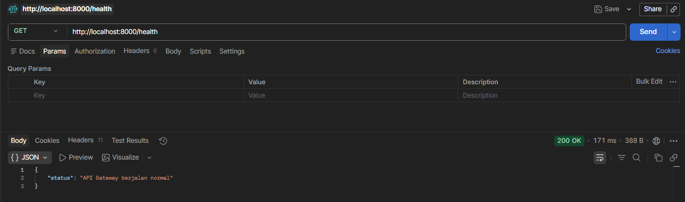
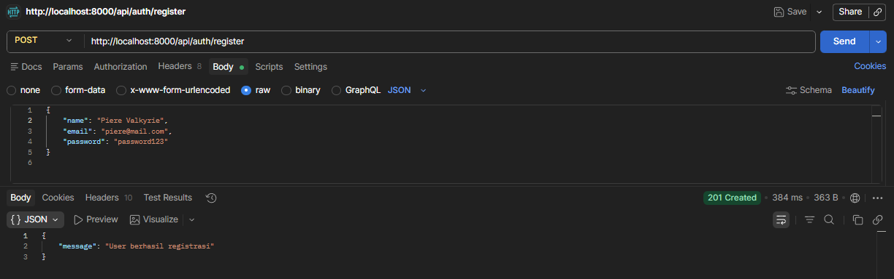
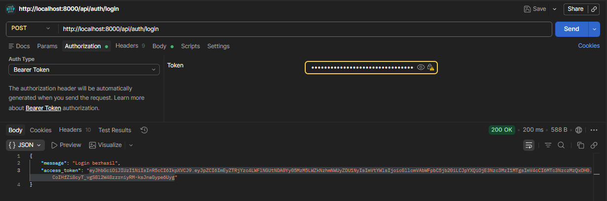
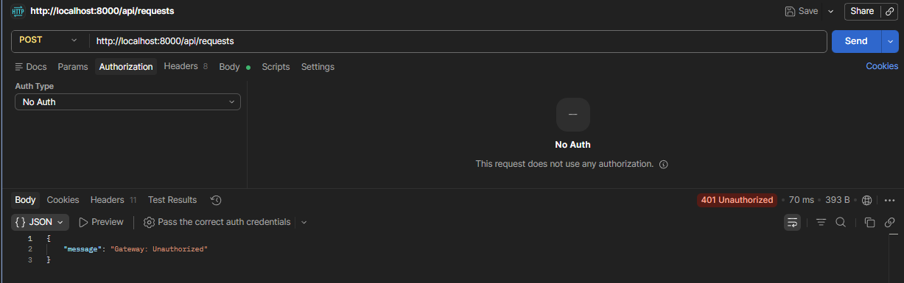
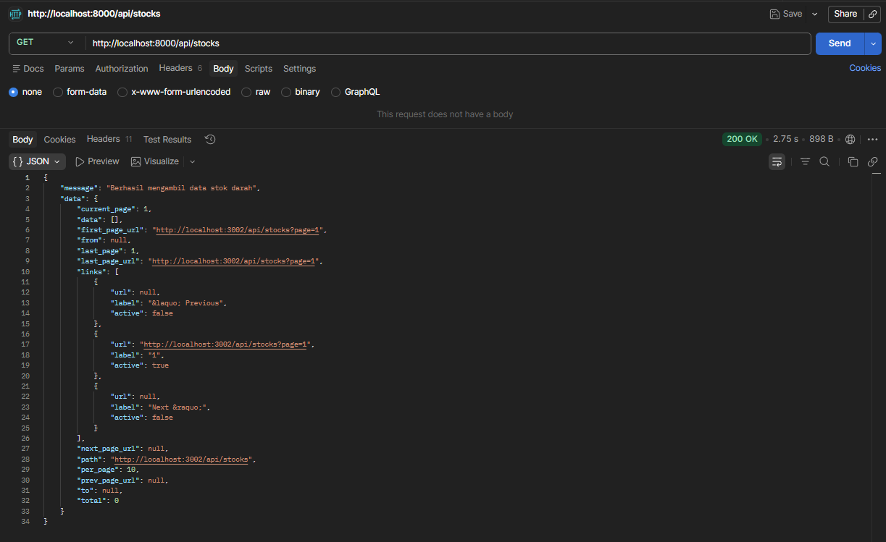
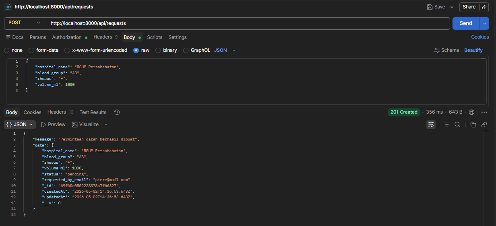

# 🩸 Sistem Donor Darah (Microservices Architecture)

Sistem Donor Darah ini adalah tugas Ujian Tengah Semester (UTS) Praktik Pengembangan Perangkat Lunak Orientasi Servis (PPLOS) Kelas B. Proyek ini dibangun menggunakan arsitektur **Microservices** yang memisahkan fitur menjadi layanan-layanan independen (Auth, Donor, dan Request) yang dihubungkan melalui sebuah API Gateway.

---

## 👨‍💻 Identitas
* **Nama**: Piere Valkyrie
* **NIM**: 2410511152
* **Kelas**: PPLOS B
* **Dosen Pengampu**: Muhammad Panji Muslim, S.Pd., M.Kom
* **Semester**: Genap TA. 2025/2026

---

## 🏗️ Arsitektur & Tech Stack

Sistem ini terdiri dari 1 API Gateway dan 3 Microservices dengan penerapan *Polyglot Persistence* (penggunaan database yang berbeda sesuai kebutuhan):

| Komponen | Port | Teknologi | Database | Deskripsi |
| :--- | :--- | :--- | :--- | :--- |
| **API Gateway** | `8000` | Node.js, Express | - | *Single entry point*, Rate Limiting, JWT Validation. |
| **Auth Service** | `3001` | Node.js, Express | MySQL (`auth_db`) | Registrasi, Login JWT, dan otorisasi Google OAuth 2.0. |
| **Donor Service** | `3002` | PHP, Laravel 11 | MySQL (`donor_db`) | Mengelola ketersediaan stok darah (Public Access). |
| **Request Service**| `3003` | Node.js, Express | MongoDB (`blood_request_db`)| Mengelola permohonan darah dari RS (Protected/JWT). |

---

## 📂 Struktur Repositori

```text
uts-pplos-b-2410511152/
│
├── gateway/                 # API Gateway (Node.js)
├── services/
│   ├── auth-service/        # Layanan Autentikasi & OAuth (Node.js)
│   ├── donor-service/       # Layanan Stok Darah (Laravel 11)
│   └── request-service/     # Layanan Permintaan Darah (Node.js + MongoDB)
│
├── docs/                    # Dokumentasi Proyek
│   ├── laporan-uts.pdf      # Laporan Lengkap UTS
│   ├── postman/
│   │   └── collection.json  # File Import untuk Testing API
│   └── screenshots/         # Bukti hasil pengujian
│
└── README.md
```

## Link Youtube Demo

**[Demo di Youtube](https://youtu.be/SK0FkuXUsFs)**

## Screenshot

1. Check Health

---

2. Register

---

3. Login

---

4. Login Unauthorized

---

5. Stocks

---

6. Request

---
